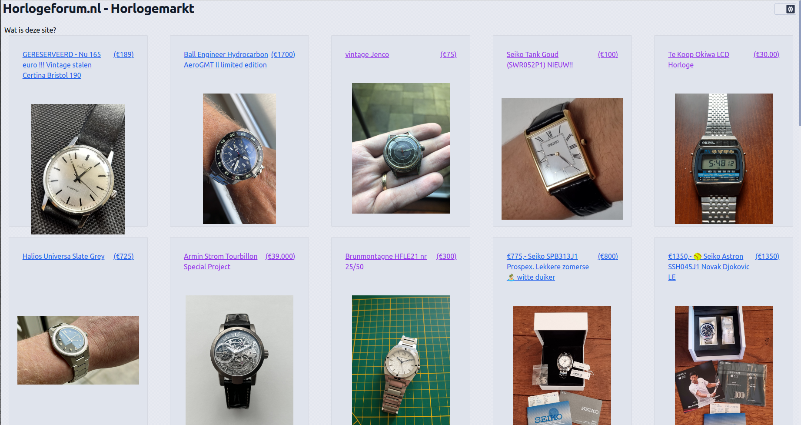

# Horlogeforum-marktview


SSR site that gives an overview of current watches being
discussed on [Horlogeforum.nl](https://www.horlogeforum.nl/c/horlogemarkt/12)'s for sale section.
[View live version here](https://horlogeforum-marktview.netlify.app/)

Tech used:

* [Sveltekit](https://kit.svelte.dev/)
* [Skeleton UI Toolkit](https://www.skeleton.dev/)
* [Netlify](https://netlify.app/)

## Developing

Once you've created a project and installed dependencies with `npm install` (or `pnpm install` or `yarn`), start a
development server:

```bash
npm run dev

# or start the server and open the app in a new browser tab
npm run dev -- --open
```
